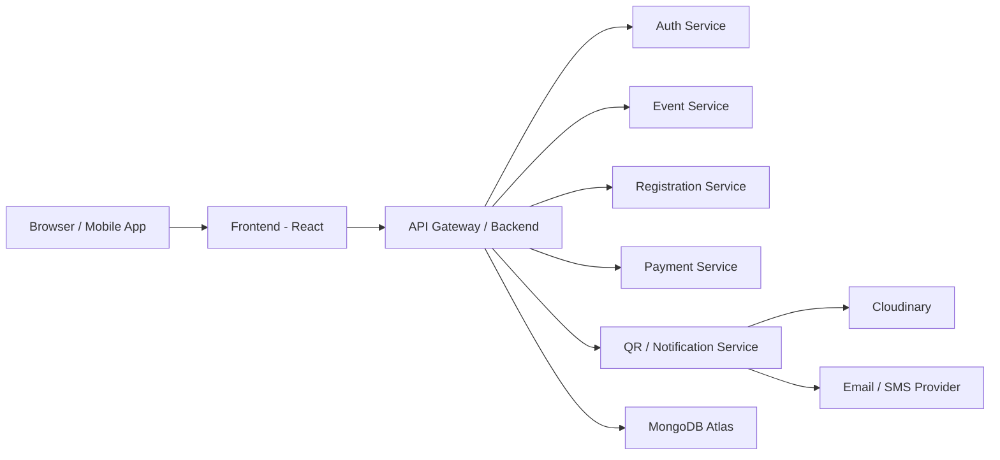
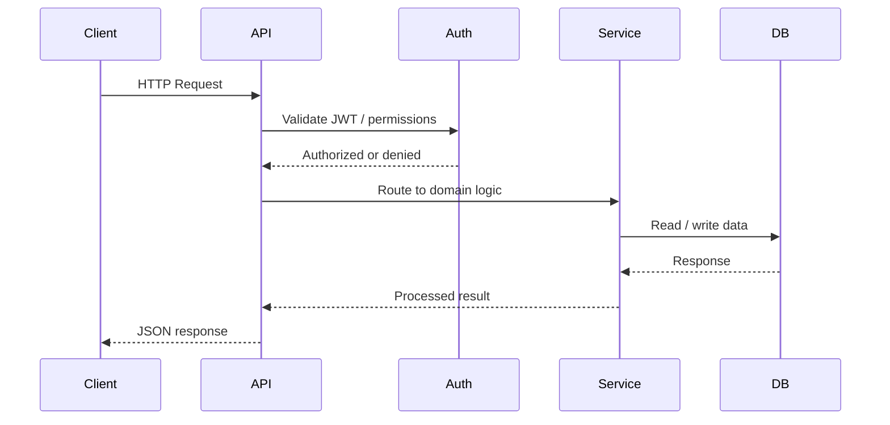
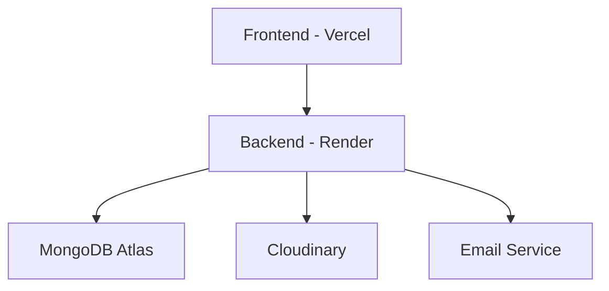

# FestSphere Architecture

## 1. Overall System Architecture

FestSphere follows a modular, cloud-ready architecture with a clear separation between frontend, backend, data layer, and integrations.



## 2. Frontend Architecture

### Principles
- Component-based UI architecture
- State management for auth, events, and payments
- Mobile-first responsive experience
- Reusable design system aligned with the existing product design

### Suggested Frontend Structure
- Pages: auth, home, events, dashboard, admin, settings
- Shared UI: layout, forms, cards, modals, tables
- State: global auth and user context
- Utilities: validation, formatting, API clients, route guards

## 3. Backend Architecture

The backend should be implemented as a set of domain-oriented services or modules within a Node.js/Express-style application.

### Core Modules
- Authentication module
- User module
- Event module
- Team module
- Registration module
- Payment module
- Notification module
- Analytics module
- Certificate module

### Design Principles
- RESTful API design
- Clear separation of concerns
- Middleware-based request validation and auth
- Transaction-safe payment and registration operations
- Centralized error handling

## 4. Request Lifecycle



## 5. Authentication Flow

1. User signs in with email and password.
2. Server verifies credentials and issues a JWT.
3. Client stores token securely in memory or secure storage.
4. Each subsequent request sends the token in the Authorization header.
5. The server validates token and attaches user context.
6. Role-based authorization determines access to protected routes.

## 6. Team Registration Flow

1. Student selects a team-based event.
2. Team leader creates the team and provides initial details.
3. Other members join the team through invite or join flow.
4. System validates team size and eligibility.
5. Team registration is finalized and payment is processed.
6. Confirmation and QR ticket are generated for the team leader and members.

## 7. Payment Flow

1. User views UPI QR and makes payment.
2. User uploads payment screenshot and submits.
3. Backend creates a pending payment order with the screenshot.
4. Admin visually verifies the payment screenshot in the dashboard.
5. Admin approves or rejects the payment.
6. Upon approval, registration is confirmed, QR ticket is generated, and a confirmation email is sent.

## 8. QR Verification Flow

1. Participant QR code is scanned by a volunteer.
2. Backend validates ticket integrity and event association.
3. Attendance status is updated.
4. Optional push or UI feedback confirms successful verification.
5. Admins can view attendance logs and reports.

## 9. Deployment Architecture



## 10. Folder Structure

```text
festsphere/
  docs/
  frontend/
    src/
      components/
      pages/
      hooks/
      services/
      store/
      styles/
  backend/
    src/
      config/
      controllers/
      middleware/
      models/
      routes/
      services/
      utils/
      validators/
  tests/
  scripts/
```

## 11. Technology Decisions

| Layer | Recommendation |
| --- | --- |
| Frontend | React with Vite or Next.js-style app structure |
| State Management | Context API or Redux Toolkit |
| Backend | Node.js with Express or NestJS-style modular service structure |
| Database | MongoDB Atlas |
| Authentication | JWT with refresh token strategy |
| File Storage | Cloudinary |
| Payments | Manual UPI Verification |
| Deployment | Vercel for frontend, Render for backend |
| Monitoring | Sentry, logs, uptime monitoring |

## 12. Scalability Considerations

- Use horizontal scaling for backend services where possible.
- Optimize database indexes for frequently queried collections.
- Cache public event listing and announcements.
- Queue asynchronous notifications and certificate generation.
- Design payment and registration flows to be idempotent.
- Use environment-specific config and secrets management.
