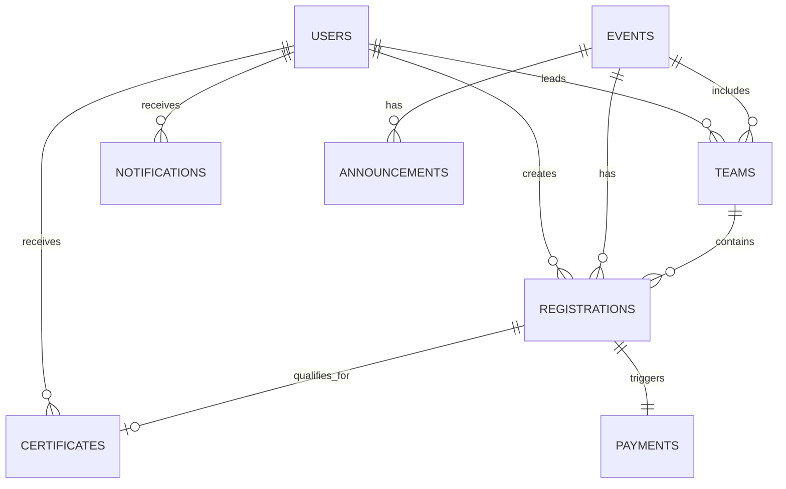

# FestSphere Database Design

## 1. Database Overview

FestSphere uses MongoDB as the primary document store. The schema is designed to support event management, registration workflows, payments, QR tickets, announcements, certificates, and notifications.

## 2. Collection Summary

- Users
- Events
- Teams
- Registrations
- Payments
- Announcements
- Certificates
- Notifications

## 3. ER Diagram

## 4. Users Collection

### Fields

| Field | Type | Description |
| --- | --- | --- |
| _id | ObjectId | Unique user ID |
| fullName | String | User full name |
| email | String | Unique email address |
| passwordHash | String | Hashed password |
| collegeId | ObjectId | Reference to college or organization |
| role | String | student, volunteer, faculty, super_admin |
| phone | String | Contact number |
| avatarUrl | String | Profile image URL |
| isActive | Boolean | Account status |
| createdAt | Date | Account creation time |
| updatedAt | Date | Last update time |

### Relationships
- One user may have many registrations.
- One user may lead one or many teams.
- One user may receive many notifications and certificates.

### Validation Rules
- Email must be unique and valid.
- Role must be one of the allowed values.
- Password hash must be present for local auth users.

### Indexes
- unique index on email
- index on role
- index on collegeId

## 5. Events Collection

### Fields

| Field | Type | Description |
| --- | --- | --- |
| _id | ObjectId | Unique event ID |
| title | String | Event title |
| slug | String | URL-safe identifier |
| description | String | Full event description |
| category | String | technical, cultural, sports, workshop |
| type | String | individual, team |
| collegeId | ObjectId | Hosting college |
| venue | String | Physical venue |
| startDate | Date | Event start time |
| endDate | Date | Event end time |
| registrationStart | Date | Registration open time |
| registrationEnd | Date | Registration close time |
| maxParticipants | Number | Maximum registrations |
| teamSize | Number | Team size for team events |
| fee | Number | Registration fee |
| status | String | draft, published, ongoing, completed, cancelled |
| bannerUrl | String | Event banner |
| createdBy | ObjectId | Admin or faculty who created event |
| createdAt | Date | Creation time |
| updatedAt | Date | Update time |

### Relationships
- One event may have many registrations.
- One event may have many teams.
- One event may have many announcements.

### Validation Rules
- Title and category are required.
- Fee must be non-negative.
- End date must be after start date.

### Indexes
- index on category
- index on status
- index on startDate
- text index on title, description

## 6. Teams Collection

### Fields

| Field | Type | Description |
| --- | --- | --- |
| _id | ObjectId | Unique team ID |
| eventId | ObjectId | Associated event |
| teamName | String | Team display name |
| leaderId | ObjectId | Team leader user |
| members | Array<ObjectId> | Team member IDs |
| status | String | pending, confirmed, full, cancelled |
| createdAt | Date | Team creation time |
| updatedAt | Date | Last update time |

### Relationships
- One team belongs to one event.
- One team has one leader and many members.
- One team may have one registration record.

### Validation Rules
- Team name required.
- Leader must exist.
- Team size must not exceed event team size.

### Indexes
- index on eventId
- index on leaderId

## 7. Registrations Collection

### Fields

| Field | Type | Description |
| --- | --- | --- |
| _id | ObjectId | Unique registration ID |
| userId | ObjectId | Registrant user |
| eventId | ObjectId | Registered event |
| teamId | ObjectId | Optional team reference |
| registrationType | String | individual, team |
| status | String | pending_payment, confirmed, cancelled, checked_in |
| paymentStatus | String | unpaid, paid, failed, refunded |
| qrTicketId | String | Unique ticket identifier |
| ticketUrl | String | QR ticket or ticket asset |
| checkedInAt | Date | Attendance check-in time |
| createdAt | Date | Registration time |
| updatedAt | Date | Last update time |

### Relationships
- One registration belongs to one user and one event.
- One registration may optionally belong to one team.
- One registration may have one payment.

### Validation Rules
- User and event are required.
- Duplicate registration for same user/event should be prevented.
- Team registrations must include teamId.

### Indexes
- unique compound index on userId + eventId
- index on status
- index on paymentStatus
- index on qrTicketId

## 8. Payments Collection

### Fields

| Field | Type | Description |
| --- | --- | --- |
| _id | ObjectId | Unique payment ID |
| registrationId | ObjectId | Associated registration |
| userId | ObjectId | Paying user |
| orderId | String | Provider order ID |
| provider | String | razorpay |
| amount | Number | Amount in rupees/paisa based on implementation |
| currency | String | INR |
| status | String | initiated, paid, failed, refunded |
| paymentMethod | String | card, upi, wallet, netbanking |
| providerResponse | Object | Raw gateway response |
| createdAt | Date | Payment time |
| updatedAt | Date | Last update time |

### Relationships
- One payment belongs to one registration.

### Validation Rules
- RegistrationId required.
- Status must be one of the allowed values.
- Payment signature verification should be enforced at application layer.

### Indexes
- index on registrationId
- index on orderId
- index on status

## 9. Announcements Collection

### Fields

| Field | Type | Description |
| --- | --- | --- |
| _id | ObjectId | Unique announcement ID |
| eventId | ObjectId | Optional event association |
| title | String | Announcement heading |
| body | String | Announcement content |
| audience | String | all, students, volunteers, faculty, admins |
| createdBy | ObjectId | Creator user |
| createdAt | Date | Creation time |
| isActive | Boolean | Visibility flag |

### Relationships
- An announcement may be tied to one event or be global.

### Validation Rules
- Title and body required.
- audience must be valid.

### Indexes
- index on audience
- index on createdAt

## 10. Certificates Collection

### Fields

| Field | Type | Description |
| --- | --- | --- |
| _id | ObjectId | Unique certificate ID |
| registrationId | ObjectId | Associated registration |
| userId | ObjectId | Recipient user |
| eventId | ObjectId | Event for which certificate is issued |
| certificateUrl | String | File URL |
| issuedAt | Date | Issue time |
| templateId | String | Optional template identifier |
| status | String | generated, issued, revoked |

### Relationships
- One certificate belongs to one registration.

### Validation Rules
- registrationId required.
- certificateUrl required when issued.

### Indexes
- index on userId
- index on eventId
- index on status

## 11. Notifications Collection

### Fields

| Field | Type | Description |
| --- | --- | --- |
| _id | ObjectId | Unique notification ID |
| userId | ObjectId | Recipient user |
| type | String | payment, registration, announcement, system |
| title | String | Notification title |
| body | String | Notification body |
| isRead | Boolean | Read status |
| createdAt | Date | Creation time |

### Relationships
- One notification belongs to one user.

### Validation Rules
- userId and title required.

### Indexes
- index on userId
- index on isRead
- index on createdAt
